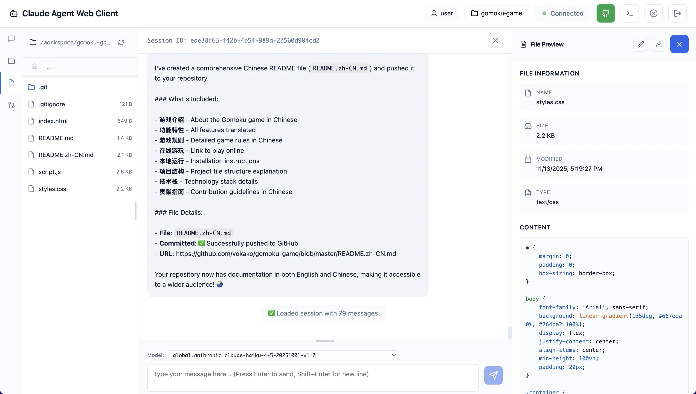

# Claude Code Web Agent on Bedrock AgentCore

[English](README.md) | 简体中文

📖 [User Guide](docs/USER_GUIDE.md) | **[用户手册](docs/USER_GUIDE.zh-CN.md)**

基于 Claude Code SDK 的生产就绪 Web Agent，部署在 AWS Bedrock AgentCore Runtime 上，使用 React 前端托管在 AWS Amplify。



## 架构概览

该解决方案提供了一个无服务器、可扩展的 Claude Code Agent，具备企业级特性：

```
┌─────────────────────────────────────────────────────────────┐
│                    AWS Amplify (Frontend)                   │
│          React Web UI with Cognito Authentication           │
└──────────────────────┬──────────────────────────────────────┘
                       │
                       ↓ HTTPS
┌─────────────────────────────────────────────────────────────┐
│             AWS Bedrock AgentCore Runtime                   │
│  ┌─────────────────────────────────────────────────────┐    │
│  │  FastAPI Backend (Claude Code SDK Wrapper)          │    │
│  │  • Session Management                               │    │
│  │  • Permission Callbacks                             │    │
│  │  • GitHub OAuth Integration                         │    │
│  │  • Workspace Management (S3)                        │    │
│  └─────────────────────────────────────────────────────┘    │
└─────────────────────────────────────────────────────────────┘
         │                    │                    │
         ↓                    ↓                    ↓
    ┌─────────┐         ┌──────────┐        ┌───────────┐
    │ Bedrock │         │  GitHub  │        │    S3     │
    │ Models  │         │   OAuth  │        │ Workspace │
    └─────────┘         └──────────┘        └───────────┘
```

### 核心组件

- **AWS Bedrock AgentCore Runtime**：用于 Claude Code SDK 的无服务器容器运行时
- **AWS Cognito**：用户身份验证和授权
- **GitHub OAuth**：通过 AgentCore Identity 访问仓库
- **Amazon S3**：用户工作区存储和同步
- **AWS Amplify**：托管 React 前端，提供 HTTPS
- **Bedrock 模型**：Claude 3.5 Sonnet、Claude 3 Haiku 及其他基础模型

## 部署

### 前置要求

- 已配置 AWS CLI 和相应凭证
- 已安装 Docker（用于构建容器镜像）
- Node.js 18+ 和 npm
- jq（JSON 处理器）
- GitHub OAuth App（用于仓库访问）

### 步骤 1：配置部署

复制并编辑配置文件：

```bash
cd deploy
cp config.env.template config.env
```

编辑 `config.env` 并设置：
- `AWS_REGION`：您的 AWS 区域
- `GITHUB_OAUTH_CLIENT_ID`：来自 GitHub OAuth App
- `GITHUB_OAUTH_CLIENT_SECRET`：来自 GitHub OAuth App
- `COGNITO_*`：（可选）现有的 Cognito 池，或留空自动创建
- 模型配置（可选，提供默认值）

### 步骤 2：构建并推送 Docker 镜像

构建后端容器并推送到 Amazon ECR：

```bash
./deploy/01_build_and_push.sh
```

此脚本会：
- 创建 ECR 仓库
- 构建 ARM64 Docker 镜像（AgentCore 要求）
- 推送到 ECR

### 步骤 3：部署 AgentCore Runtime

将后端部署到 Bedrock AgentCore：

```bash
./deploy/02_deploy_agentcore.sh
```

此脚本会：
- 创建/更新 AgentCore Runtime
- 创建 S3 工作区 bucket
- 设置 Cognito 用户池（如需要）
- 创建具有所需权限的 IAM 执行角色
- 配置 GitHub OAuth 提供商
- 导出配置到 `.agentcore_output`

### 步骤 4：部署 Amplify 前端

将 React 前端部署到 AWS Amplify：

```bash
./deploy/03_deploy_amplify.sh
```

此脚本会：
- 创建/更新 Amplify 应用
- 构建并部署 React 前端
- 配置环境变量
- 自动更新 OAuth 回调 URL
- 提供 Amplify 应用 URL

### 步骤 5：更新 GitHub OAuth App

部署后，更新您的 GitHub OAuth App 设置：

1. 访问 https://github.com/settings/developers
2. 选择您的 OAuth App
3. 更新 **Authorization callback URL** 为：
   ```
   https://main.YOUR_AMPLIFY_DOMAIN/oauth/callback
   ```

### 完整部署

一次性运行所有步骤：

```bash
./deploy/deploy_all.sh
```

## 主要特性

### 企业级身份验证
- **AWS Cognito**：安全的用户注册和登录
- **JWT tokens**：使用 bearer token 的无状态身份验证
- **邮箱验证**：可选的邮箱域名限制

### GitHub 集成
- **OAuth2 身份验证**：安全的 GitHub 账号关联
- **仓库访问**：克隆和管理 GitHub 仓库
- **AgentCore Identity**：无需存储密钥的凭证管理

### 工作区管理
- **S3 同步**：持久化工作区存储
- **多用户支持**：每个用户的独立工作区
- **高性能同步**：使用 s5cmd 进行快速传输

### Agent 能力
- **多会话支持**：处理多个并发会话
- **权限系统**：用户控制 agent 操作
- **会话恢复**：恢复之前的对话
- **实时流式传输**：使用 SSE 获得实时 agent 响应

### 模型支持
- Claude 3.5 Sonnet（主要模型）
- Claude 3 Haiku（后台任务）
- Qwen 3 Coder 480B（专注代码）
- LiteLLM 代理支持其他提供商

## 本地开发

无需 AWS 部署的本地开发和测试：

### 前置要求
- Python 3.12+
- [uv](https://github.com/astral-sh/uv) - 快速 Python 包管理器
- Node.js 18+

### 设置

```bash
# 安装 uv
curl -LsSf https://astral.sh/uv/install.sh | sh

# 安装依赖
uv sync

# 启动后端服务器
uv run backend/server.py

# 在另一个终端启动 Web 客户端
cd web_client
npm install
npm run dev
```

访问 http://localhost:8080 查看 Web 界面。

### 开发工具

```bash
# 使用热重载启动服务器
uv run uvicorn backend.server:app --host 127.0.0.1 --port 8000 --reload

# 格式化代码
uv run ruff format backend/

# 运行测试
uv run pytest
```

## 配置

### 环境变量

后端的关键环境变量（部署后通过 `.agentcore_output` 设置）：

- `AGENT_RUNTIME_ARN`：AgentCore Runtime ARN
- `AGENT_RUNTIME_URL`：AgentCore Runtime 端点 URL
- `COGNITO_USER_POOL_ID`：Cognito 用户池 ID
- `COGNITO_CLIENT_ID`：Cognito 应用客户端 ID
- `GITHUB_OAUTH_PROVIDER_NAME`：GitHub OAuth 提供商名称
- `S3_WORKSPACE_BUCKET`：工作区的 S3 bucket
- `OAUTH_CALLBACK_URL`：OAuth 回调 URL（Amplify 应用 URL）

### Web 客户端环境变量

在 `web_client/.env` 中配置：

- `VITE_DEFAULT_SERVER_URL`：AgentCore Runtime URL
- `VITE_COGNITO_REGION`：AWS 区域
- `VITE_COGNITO_USER_POOL_ID`：Cognito 用户池 ID
- `VITE_COGNITO_CLIENT_ID`：Cognito 应用客户端 ID
- `VITE_USE_INVOCATIONS`：使用统一调用端点（true/false）

## API 端点

后端提供以下关键端点：

- `POST /invocations` - 统一调用端点（主要）
- `POST /sessions` - 创建新会话
- `POST /sessions/{id}/messages` - 发送消息
- `GET /sessions/{id}/status` - 获取会话状态
- `GET /sessions/{id}/history` - 获取对话历史
- `POST /agentcore/session/stop` - 停止 AgentCore 会话（已弃用，使用直接调用）
- `GET /github/oauth/token` - 获取 GitHub OAuth token
- `GET /github/repositories` - 列出用户的仓库
- `POST /workspace/init` - 从 S3 初始化工作区
- `POST /workspace/clone-git` - 克隆 Git 仓库
- `GET /health` - 健康检查

完整 API 文档：`https://YOUR_RUNTIME_URL/docs`

## 架构文档

详细文档请参见 `claude/` 目录：

- **[架构](claude/architecture.md)** - 系统设计和组件
- **[工作区同步](claude/workspace-sync.md)** - S3 工作区管理
- **[Web 客户端](claude/web-client/readme.md)** - Web 界面文档
- **[用户注册](claude/cognito-signup-guide.md)** - AWS Cognito 用户注册配置
- **[部署指南](deploy/README.md)** - 详细部署说明

## 清理

删除所有已部署的资源：

```bash
./deploy/cleanup.sh
```

这将删除：
- Amplify 应用
- AgentCore Runtime
- IAM 角色
- S3 工作区 bucket（可选）
- ECR 仓库（可选）

## 许可证

与父项目 Claude Agent SDK 相同。
